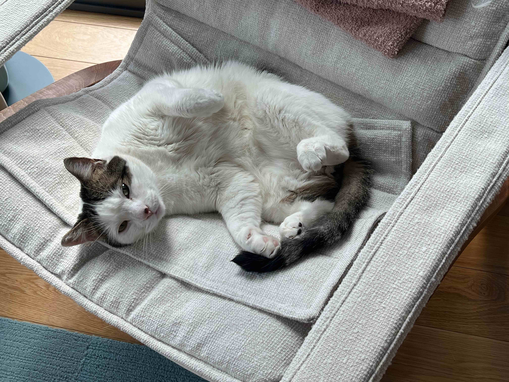

# This is SZ's awesome website


 
## Here is a subsection

And here is some additon text

```{r}
rnorm(10)
```


## Links to other websites

Let's link to useful tools for 

* [Google](https://www.google.com/)
* [p8105](https://p8105.com)

## locl images



## link to page within the site

[About me](website_template/about.html)


